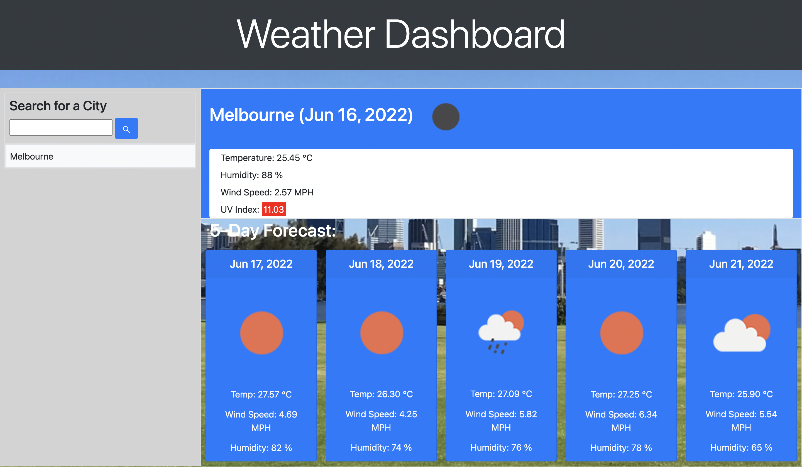

# Weather-Dashboard

## Description
This weather dashboard allows users to search for a city to get the current weather and 5 day forecast. It will display the city name, the date, an icon reprentation of weather conditions, the temperature, the humidity, the wind speed and the UV index. The UV index will be color code. This Weather Dasboard was created using The Open Weather Map data API, allow me to access their data and functionality by making request with a specific parameters to a URL with a subscription to get an APIkey, in order to get all the information about the weather condition. The initial search based on city name returns latitute and longitude coordinates, and these coordinates are used in the UV index get request.Also I used Javascript Date object, in order to display dates on the current condition and forecast, return by the Open Weather Map response is converted into a Date, then getDate, getMonth and getFullYear methods to generate the date strings displayed on the page. I used One Call API for free subscrition. To get Quickly design and customize responsive mobile-first site using Bootstrap is very helpfull as a powerful JavaScrip plugins. Bootstrap includes HTML and CSS based design templates for typography, forms, buttons, tables, navigation, modals, image carousels and many others.

## Demo

## Link to Website

https://b-smd.github.io/Weather-Dashboard/

https://github.com/B-smd/Weather-Dashboard

## Technologies Used
- HTML
- CSS
- JavaSript
- Bootstrap
- Third-party APIs

## Usage
As a user you can type the city you want to know the weather condition in the form inputs, then you will presented with current and future conditions for that city, this city will be added to search history. You can view current weather conditions for that city, presented with the city name, the date, an icon representation of weather conditions, the temperature, the humidity, the wind speed, and the UV index with a color that indicates weather the conditions are favorable, moderate, or severe. You can view future weather conditions for that city and it is presented with 5-day forecast that displays the date, an icon representation of weather conditions, the temperature, the humidity, and the wind speed. If you click one of a city in the search history, the current and future weather conditions will appear for that city.

## Contributing
Pull request are welcome, you can make a constribution at the bottom of any docs page to make small changes such as a typo, sentence fix or a broken link. For major changes, please open an issue first to discuss what you would like to change.

## Licence
[MIT]
(http)://choosealicence.com/licences/mit/)
